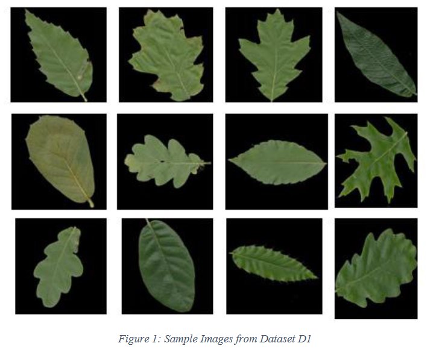
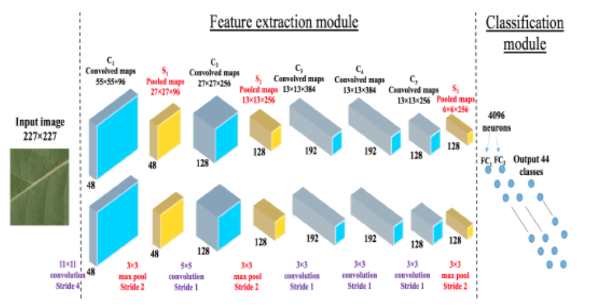
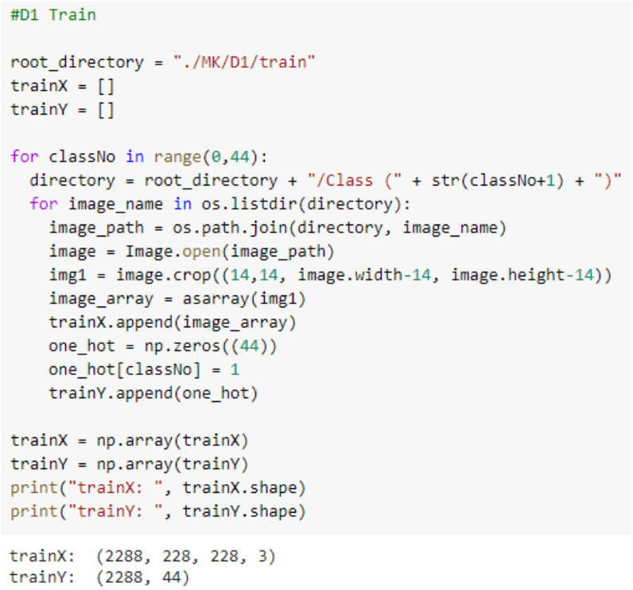
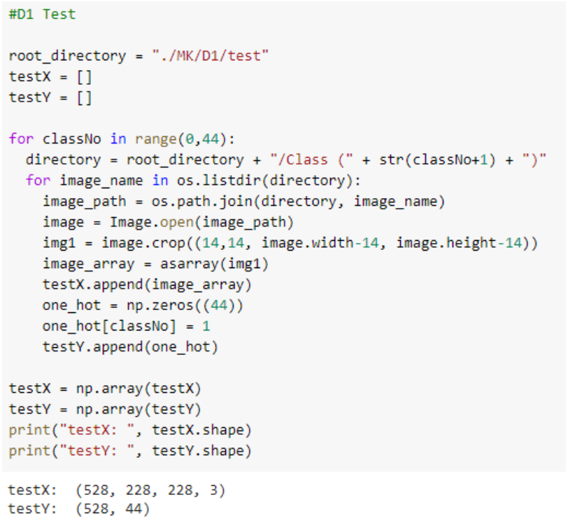
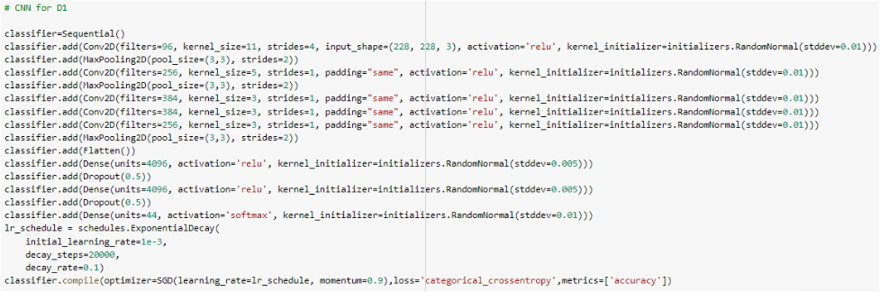
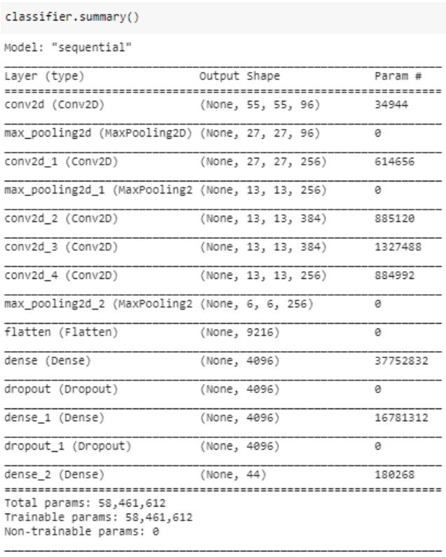
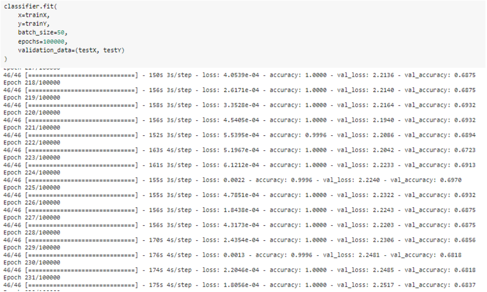
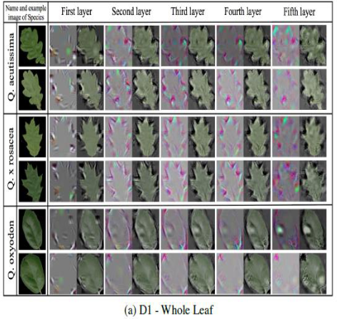

<h1 align="center">NNFL-IA1</h1>

<b>Contributors</b>

  
 
  

| Name             | Roll No |
|------------------|---------|
| Babita Rataudi   | 1813090 |
| Dhairya Katariya | 1813091 |
| Sankalp Jain     | 1813084 |
  

<b>Introduction</b>

   
 Plants are a very important living factor on earth providing us with food, medicine, and oxygen. A good understanding of plants is essential to help in identifying new or rare plant species in order to improve the drug industry, balance the ecosystem as well as the agricultural productivity and sustainability. To do this lot of botanists are working hard by analyzing different characteristics of the leaf as a comparative tool for their study on plants. This is because leaf characteristics are available to be observed and examined throughout the year indeciduous, annual plants, or year-round in evergreen perennials. But using computer vision time, effort, and manpower required for this task can be reduced. Plant identification using computer vision is still considered a challenging and unsolved problem. This is because all plants in nature have a very similar shape, color, and other characteristics in general.  In this project, we have used convolutional neural networks (CNN) to learn feature representations for  44  different plant species,  collected at the  Royal Botanic Gardens, Kew, England. We have used this dataset and generated two different datasets from it which are D1 to check which features of the leaf are more efficient and robust in correctly classifying plant species from the given image of a leaf.
   

<b>Dataset Required</b>

 
Dataset (D1): Here wehave used MalayaKew (MK) Leaf Dataset which consists of 44 classes. This dataset is very  challenging  as  the  leaf  images  from  different  classes  in  this  dataset  have  very  similar appearance. This dataset (D1) mainly consist of images of entire leaf of plants.To enlarge the D1 dataset, we rotate the each of the leaf images in 7 different orientations, e.g. 45°, 90°, 135°, 180°, 225°, 270° and 315°.We then randomly select 528 leaf images for testing and 2288 images for training. 
   
 

</img>

<b>Suggested Neural Network</b>

  We have proposed following CNN model to automatically learn the features representation for plant categories, replacing the need of designing hand-crafted features as a means to perform plant classification.
 
   

</img>

<b>Project Code</b>

 

</img>
 
 

</img>
 
 

</img>
 
 

</img>
 
 

</img>
 

<b>Output</b>

 

</img>
 

<b>Things Done During The Project  </b>

 

|    | Project Explaination                                                                                                                                                                                                                                                                                                                                                                                                                                                                                |
|----|-------------------------------------------------------------------------------------------------------------------------------------------------------------------------------------------------------------------------------------------------------------------------------------------------------------------------------------------------------------------------------------------------------------------------------------------------------------------------------------------------------|
| 1  | Our topic is plant classification using Deep CNN, the objective of our project is that given an image of a leaf we need to classify to which species the leaf or the part belongs, it means that we are using a multiclass classification problem where we want to classify the given image into 44 different species of 44 different classes.                                                                                                                                                        |
| 2  | So for that purpose, we have taken dataset D1 that consists of images where the entire leaf is seen in the image.                                                                                                                                                                                                                                                                                                                                                                                     |
| 3  | For the implementation firstly we have imported all the required libraries i.e. OS to access images in the directories and as we are handling the images, so we have used the PIL library to obtain the NumPy equivalent for the images.                                                                                                                                                                                                                                                              |
| 4  | As we are using Keras to implement our CNN architecture, we have also imported all the required layers for our module.                                                                                                                                                                                                                                                                                                                                                                                |
| 5  | Now the dataset we obtained consisted of 44 folders corresponding to the 44 different species of the plants, containing respective of their leaf images.                                                                                                                                                                                                                                                                                                                                              |
| 6  | Here we have looped over to access each image. Initially, the image size was 258x258 pixels, we have cropped them equally from all the sides to generate 228x228 pixels images, since we are using Alex Net, so we require 227x227 pixels images for the input.                                                                                                                                                                                                                                       |
| 7  | By using PIL we have converted the image into a NumPy array of size 228x228x3, 3 because we are using the RGB images, so we need 3 different channels for red, green, and blue.                                                                                                                                                                                                                                                                                                                       |
| 8  | Then this we append to trainX and simultaneously we append a one-hot vector for the current image to trainY.                                                                                                                                                                                                                                                                                                                                                                                          |
| 9  | So we got 2288 images for training and similarly, we have converted images for testing and we got 528 images for testing.                                                                                                                                                                                                                                                                                                                                                                             |
| 10 | Now let us understand the model that we are implementing, it begins with convolution layers with 96 filters of size(11x11x3), 3 because we have to apply a filter over the 3 channels because of RGB image, with strides=4 which means the filter will shift on the image, horizontally and vertically by 4px.                                                                                                                                                                                        |
| 11 | Then we have used the relu activation function because we don’t want our gradient to easily saturate to 0, also we want partial learning rates and another advantage of using relu is that it does not activate all the neurons at the same time because if the input is negative than the result is 0 that means no neuron gets activated and some neuron gets deactivated which may also increase computational speed for our model.                                                                |
| 12 | Further, we have used kernel initializer to initialize weights for this layer with random values using the normal distribution, such that for any value the standard deviation is 0.01. 13. In each convolution layer, we have applied a filter and the length and width of the feature matrix reduce whereas height increase because in each filter outputs are 2D matrix and results of such matrix filters are stacked together so that the height of the feature matrix increases and becomes 96. |
| 13 | Next in the max-pooling layer the filter size we have used is 3x3, this 3x3 filter will be applied across the feature map obtained from the previous layer and the max pooling operation will select the maximum element from the region of the feature map covered by the filter currently.                                                                                                                                                                                                          |
| 14 | Thus the output of the max-pooling layer will be the most prominent feature of the previous feature.                                                                                                                                                                                                                                                                                                                                                                                                  |
| 15 | Further, one convolution is applied with 256 filters of 5x5 also we added padding which will add a pixel border on the image such that the output size is equal to the input size.                                                                                                                                                                                                                                                                                                                    |
| 16 | After some more convolution layers, we had used a dropout of 0.5 which will deactivate 50% of neurons which will save us from overfitting.                                                                                                                                                                                                                                                                                                                                                            |
| 17 | Lastly, we got 44 neurons because we have 44 classes of plants.                                                                                                                                                                                                                                                                                                                                                                                                                                       |
| 18 | Then we had given batch_size 50 with 40 epoch we got validation accuracy.                                                                                                                                                                                                                                                                                                                                                                                                                             |                                                                                                                |                                                                                                                       |

 

<b>Conclusion</b>

  
 

In this project, we studied a deep learning approach to learn discriminative features from leaf images with classifiers for plant identification.  From the experimental results, we justified that learning the features through  CNN  can provide better feature representation for leaf images compared to hand-crafted features.  Moreover,  we demonstrated that venation structure is an important feature to identify different plant species.
 

</img>

  
  

